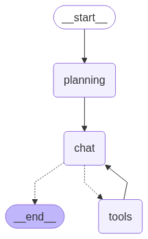

# Olympiad AI Agent Exercise

This is a simple exercise to get you started with AI agents.

## Setup

### Prerequisites

Install [uv](https://github.com/astral-sh/uv) (Python package manager):

```bash
# On macOS and Linux
curl -LsSf https://astral.sh/uv/install.sh | sh

# On Windows
powershell -c "irm https://astral.sh/uv/install.ps1 | iex"
```

### Installation

```bash
git clone https://github.com/idanivanov/olympiad-ai-agent-exercise.git
cd olympiad-ai-agent-exercise
uv venv
uv sync
```

### Configuration

Create a `.env` file in the root of the project and add your environment variables.

#### Required Environment Variables

- `OPENAI_API_KEY`: Your OpenAI API key
- `LANGCHAIN_API_KEY`: Your LangChain API key for LangSmith tracing

#### Optional Environment Variables

- `LANGCHAIN_TRACING_V2`: Whether to use LangSmith tracing v2
- `LANGCHAIN_ENDPOINT`: The LangSmith endpoint
- `LANGCHAIN_PROJECT`: The LangSmith project

### Running the Agent

```bash
uv run main.py
```

## Agent Design

The agent is implemented with the **LangGraph** framework (a graph-oriented wrapper around LangChain).  It is composed of three logical nodes that communicate over directed edges:

1. **Planning (`PlanningNode`)**  
   • Runs first for every new user input.  
   • Prepends a special system prompt that asks the model to *think step-by-step* and return a concise bullet-point **plan** (3-6 items).  
   • Emits the plan as a `SystemMessage` named `plan`, keeping it in the conversation for downstream nodes.

2. **Chat (`ChatNode`)**  
   • Uses the same LLM but **with tools bound**.  
   • Decides whether it can answer immediately or needs extra information from a tool.  
   • If the model returns a `tool` invocation, control flows to the *Tools* node; otherwise the assistant’s answer is streamed to the user.

3. **Tools (`ToolNode`)**  
   • Wraps the toolkit defined in `src/olympiad_ai_agent_exercise/tools.py`.  
   • After the selected tool executes, its output is fed back to the *Chat* node so the model can incorporate the result and choose the next action.

### Available tools

- **Web search**: `TavilySearch` (returns the top 2 results).  
- **File-system toolkit** (rooted at `./data/`):  
  • `read_file`  
  • `write_file`  
  • `list_directory`

### Graph edges



The graph is compiled with a `MemorySaver` check-pointer so that conversation state persists automatically between steps.  The helper method `agent.save_graph_to_png()` generates the diagram shown above.
